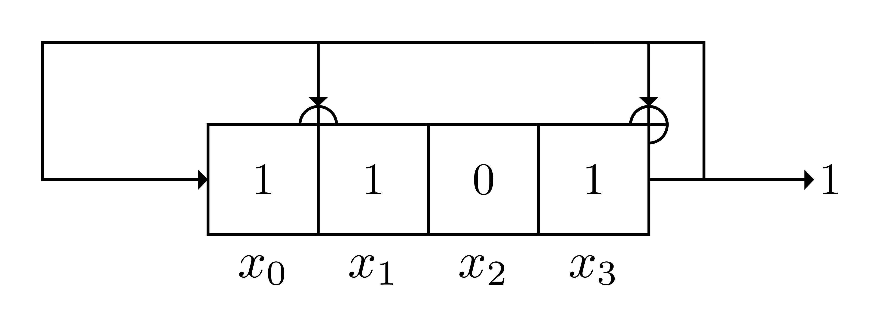
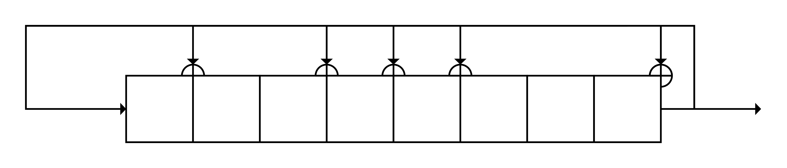

# GalDraw

## Galois LFSR Diagram Generator

A Python script to generate visual diagrams of Galois Linear Feedback Shift Registers (LFSRs) using LaTeX/TikZ.

## Overview

This tool generates clear, professional-looking diagrams of Galois LFSRs, which are a specific type of Linear Feedback Shift Register where the feedback taps are XORed with the output bit before being fed into the next register. Each LFSR implementation has its own advantages:

- Galois is more parallel, Fibonacci more serial
- Galois reveals finite field operation, Fibonacci recursion in sequence

## Features

- Generate Galois LFSR diagrams in multiple formats (PDF, PNG, EPS)
- Customize tap positions and initial values
- Show/hide register values and names
- High-quality vector output using LaTeX/TikZ

## Dependencies

- Python 3.x
- LaTeX installation with TikZ package
- ImageMagick (for PNG output)
- pdftops (for EPS output)

## Usage

Basic usage with default values (4-bit LFSR with taps [1,0,0,1] and initial values [1,1,1,1]):

```bash
python3 lfsr_draw.py
```

Customize tap positions and initial values:

```bash
python3 lfsr_draw.py --taps 110101 --init-values 100001
```

Generate multiple output formats:

```bash
python3 lfsr_draw.py --format all
```

### Command Line Options

- `--taps`: Tap sequence as a string of 0s and 1s (rightmost is x_0, default: 1001)
- `--init-values`: Initial values as a string of 0s and 1s (default: 1111)
- `--hide-values`: Hide values in the LFSR boxes
- `--hide-names`: Hide box names under the LFSR boxes
- `--format`: Output format: pdf (default), png, eps, or all

## Example Outputs

### 4-bit Galois LFSR

```bash
python3 lfsr_draw.py --taps 1001 --init-values 1101
```



### 8-bit Galois LFSR

```bash
python3 lfsr_draw.py --taps 10111001 --init-values 11001011
```


### 8-bit Galois LFSR with hidden values and names

```bash
python3 lfsr_draw.py --taps 10111001 --init-values 11001011 --hide-values --hide-names
```



## Credits

This project is a modified version of the [LFSR-Automatic-Draw](https://github.com/kelalaka153/LFSR-Automatic-Draw) tool, adapted to focus on Galois LFSRs.
